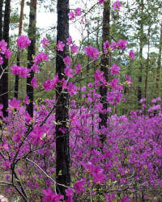
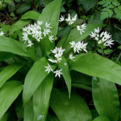
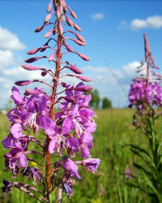
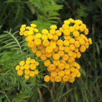
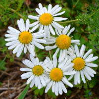
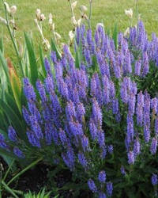

Полезные, лекарственные травы, растущие на просторах России.

  
[bagulnik](bagulnik.jpg)

  
[cheremsha](cheremsha.jpg)

  
[ivan-tchai](ivan-tchai.jpg)

  
[pizhma](pizhma.jpg)

  
[romashka](romashka.jpg)

  
[shalvey](shalvey.jpg)

* [zveroboy](zveroboy.jpeg)
* [Багульник](Багульник.md)
* [Зверобой](Зверобой.md)
* [Иван-чай](Иван-чай.md)
* [Пижма](Пижма.md)
* [Ромашка](Ромашка.md)
* [Черемша](Черемша.md)
* [Шалфей](Шалфей.md)