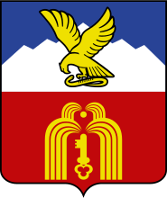

<!--2022-08-03 00:20:02-->
### Пятигорск
Город на юге России, минеральный и грязевой курорт. 
Туристический центр района *Кавказских Минеральных Вод*.

 
Население &emsp; ***145,000*** &emsp;
Год&nbsp;основания &emsp; ***1780***