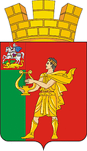

<!--2021-11-01 00:28:03-->
### [Апрелевка]()
Город в *28* км к юго-западу от Москвы на берегу реки Десны.
В нем находится известный в прошлом бывший завод грампластинок фирмы "*Мелодия*".

  
Население &emsp; ***30,000*** &emsp; 
Год&nbsp;основания &emsp; ***1899***
