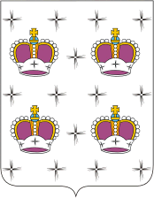

<!--2021-10-26 00:48:44-->
### Дмитров
Город в *50* км к северу от Москвы. В советское время в городе проживало руководство *Дмитлага*,
занимавшегося строительством *Канала имени Москвы* (канал Москва - Волга).
Сейчас является центром зимних видов спорта Московской области.

 
Население &emsp; ***68,000*** &emsp; 
Год&nbsp;основания &emsp; ***1154***