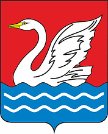

<!--2021-11-14 01:37:09-->
### [Долгопрудный]()
Город рядом с северной границей Москвы.
В нём располагается *Московский Физико-Технический Институт* (МФТИ).

 
Население &emsp; ***117,000*** &emsp;
Год&nbsp;основания &emsp; ***1931***