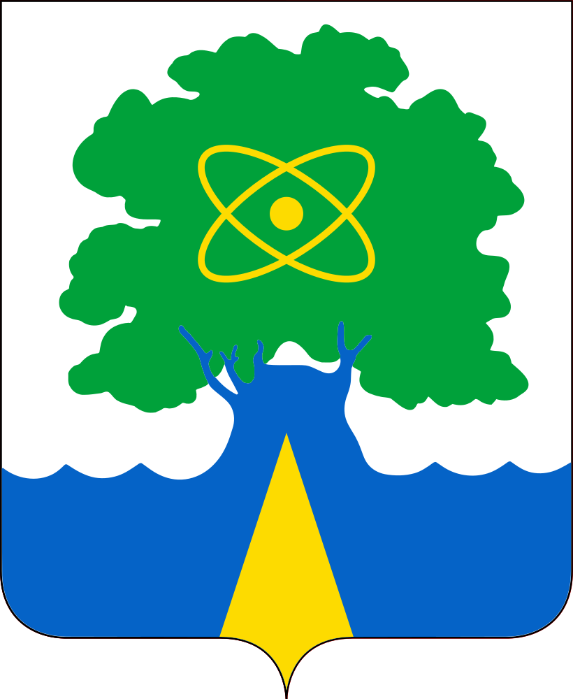

<!--2021-10-17 15:05:26-->
### Дубна
Город-наукоград в *120* км к северу от Москвы. Единственный город московской области на берегу Волги.

 
Население &emsp; ***75,000*** &emsp;
Год&nbsp;основания &emsp; ***1956***