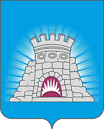

<!--2021-10-31 01:30:04-->
### [Зарайск]()
Город в *145* км к юго-востоку на берегу реки Осётр.
В городе находятся музейный комплекс "*Зарайский Кремль*", крупное обувное производство.

 
Население &emsp; ***23,000*** &emsp; 
Год&nbsp;основания &emsp; ***1146***