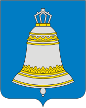

<!--2021-10-31 00:30:04-->
### [Звенигород]()
Город в *30* км к западу от Москвы на берегах реки Москвы.
В окрестностях города расположены многочисленные санатории, дома отдыха и туристические места маршруты.

 
Население &emsp; ***22,000*** &emsp;
Год&nbsp;основания &emsp; ***1152***