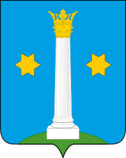

<!--2021-11-20 14:44:22-->
### [Коломна]()
Город в *100* км к югу от Москвы в месте впадения реки Москва в Оку.
Один из древнейших городов Подмосковья, в нем располагается крепость *16* века *Коломенский кремль*, 
музей пастилы.

 
Население &emsp; ***140,000*** &emsp; 
Год&nbsp;основания &emsp; ***1160***