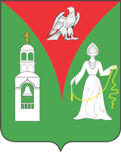

<!--2022-07-09 12:15:33-->
### [Ликино-Дулево]()
Город в *78* км восточнее Москвы, в *7* км южнее города Орехово-Зуево.
В городе располагаются крупные промышленные предприятия:
*Дулёвский фарфоровый завод*, 
*ЛиАЗ* (производитель автобусов),
*Дулёвский красочный завод*.

 
Население &emsp; ***28,800*** &emsp; 
Год&nbsp;основания &emsp; ***1930***