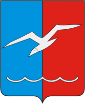

<!--2021-10-20 00:50:11-->
### [Лобня]()
Город в *15* км к северу от Москвы. Расположен на берегах реки Лобня, рядом с аэропортом Шереметьево.

 
Население &emsp; ***90,000*** &emsp; 
Год&nbsp;основания &emsp; ***1902***