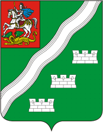

<!--2021-11-12 01:16:03-->
### [Наро-Фоминск]()
Город на берегу реки Нара на юге МО. В *2009* году получил статус "*Город воинской славы*".

 
Население &emsp; ***67,000*** &emsp;
Год&nbsp;основания &emsp; ***1840***