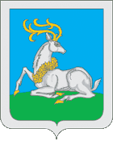

<!--2022-01-11 01:24:04-->
### [Одинцово]()
Западный город-спутник Москвы.
Через город проходит федеральная трасса Можайское шоссе.
В гороже насчитывается наибольшее число машин на тысячу жителей в Московском регионе.

 
Население &emsp; ***136,000*** &emsp; 
Год&nbsp;основания &emsp; ***1470***