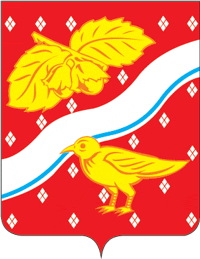

<!--2021-11-06 01:56:04-->
### Орехово-Зуево
Город на реке Клязьма расположен в *80* км к востоку от Москвы.
Исторически возник от слияния сёл Орехово и Зуево, где в середине *19* века промышленники Морозовы
построили многочисленные ткацкие и бумагопрядильные фабрики. 

 
Население &emsp; ***120,000*** &emsp; 
Год&nbsp;основания &emsp; ***1917***