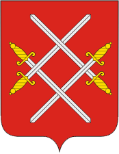

<!--2021-11-28 14:21:01-->
### [Руза]()
Город расположен на реке Рузе, в *80* км к западу от Москвы. 
Был оккупирован и разрушен немцами во время ВОВ.
Живописные окрестности Рузы являются популярными дачными местами.

 
Население &emsp; ***13,000*** &emsp; 
Год&nbsp;основания &emsp; ***1328***