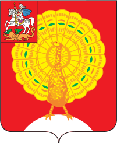

<!--2021-10-23 23:26:17-->
### [Серпухов]()
Город расположен в южной части Московской области на реке Наре в *73* км от столицы.
В городе много старинных церквей, монастырей и памятников. 
Является претендентом на включение в список древних городов "*Золотое кольцо России*".

 
Население &emsp; ***125,500*** &emsp;
Год&nbsp;основания &emsp; ***1339***