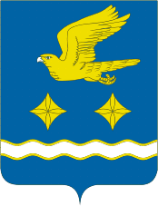

<!--2021-10-30 01:25:20-->
### [Ступино]()
Город в *100* км к югу от Москвы.
В городе расположены предприятия по выпуску запчастей для авиационной промышленности.
Рядом с городом расположен военный аэродром.

 
Население &emsp; ***65,500*** &emsp; 
Год&nbsp;основания &emsp; ***1938***