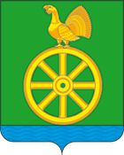

<!--2021-11-25 00:22:22-->
### [Черусти]()
Посёлок городского типа в *150* км к востоку от Москвы.
Расположен в Мещёрской низменности. Считается самым холодным местом Подмосковья.

 
Население &emsp; ***2,500*** &emsp; 
Год&nbsp;основания &emsp; ***1911***