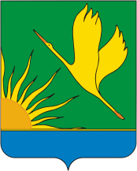

<!--2021-10-30 00:47:59-->
### Шатура
Город на востоке Московской области в *122* км от МКАД в болотистой местности, богатой торфом
В городе расположены крупнейшая в России мебельная фабрика и большая электростанция.

 
Население &emsp; ***32,000*** &emsp;
Год&nbsp;основания &emsp; ***1928***