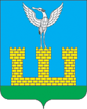

<!--2021-10-26 00:36:01-->
### [Шаховская]()
Посёлок городского типа в *110* км от Москвы на северо-запад.
Посёлок появился и развивался при одноименной станции Московской железной дороги.

 
Население &emsp; ***10,500*** &emsp; 
Год&nbsp;основания &emsp; ***1901***