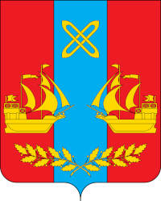

<!--2021-11-16 00:57:05-->
### Яхрома
Город в *55* км к северу от Москвы на одноименной реке.
В Яхроме расположен крупнейший в МО горнолыжный курорт.

 
Население &emsp; ***14,000*** &emsp; 
Год&nbsp;основания &emsp; ***1841***