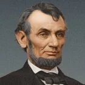

<!--2017-07-21 21:16:04-->
### [Авраам Линкольн, американский президент]()

    Кто хочет ищет возможности, кто не хочет ищет причины.

>

    Многие способны выдержать удары судьбы, но, если 
    вы хотите в самом деле испытать характер человека,
    дайте ему власть.

>

    Мы не поможем людям, делая за них то, 
    что они могли бы сделать сами.

>

    Люди, не имеющие недостатков, 
    имеют очень мало достоинств.

>

    Брак и не рай и не ад, это просто чистилище.

>

    Я побеждаю своих врагов тем, что превращаю их в друзей.

>

    В конечном счете, важны не годы в вашей жизни, 
    а жизнь в ваших годах.