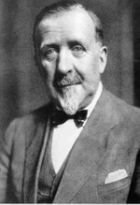

<!--2016-04-17 10:01:10-->
### [Генрих Манн, немецкий писатель]()

    Простому человеку немногое нужно, чтобы придти 
    в хорошее расположение духа.

>

    Главная причина успеха в любом деле - 
    умение работать с людьми.