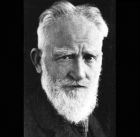

<!--2018-12-15 18:47:55-->
### [Джордж Бернард Шоу, выдающийся ирландский драматург, лауреат Нобелевской прем]()

>

    Человек, который видит жизнь в истинном свете,
    а истолковывает ее романтически, обречен на отчаяние.

>

    Рождество — это время года, когда мы должны покупать 
    вещи, которые никому не нужны, и дарить их людям, 
    которые нам не нравятся.

>

    Бойся человека, Бог которого живёт на небе.

>

    Дом — тюрьма для мужчины и работный дом для женщины.

>

    Думающие женщины — это те, о которых не думают.

>

    Жизнь — это не поиск себя. Жизнь — это создание себя.

>

    Кто умеет, делает; кто не умеет, учит других.

>

    Одиночество — великая вещь, но не тогда, когда ты один.

>

    Уметь выносить одиночество и получать от него удовольствие — 
    великий дар.

>

    Цензура в конце концов приходит к тому, 
    что запрещены все книги, кроме тех, которых никто не читает.