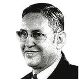

<!--2018-04-21 23:35:54-->
### Карлос Кастанеда, американский писатель-эзотерик

    Умение закалять свой дух в то время, когда тебя попирают
    и топчут, вот что называется контролем.

>

    Если тебе не нравится, то что ты получаешь - измени то, 
    что ты даешь.

>

    Сначала мы учимся обо всем думать, а потом учимся смотреть 
    на вещи так, как о них думаем.