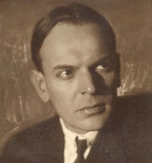

<!--2019-12-14 22:57:50-->
### Константин Паустовский, русский писатель

    Осень пришла внезапно. Так приходит ощущение счастья 
    от самых незаметных вещей – от далекого пароходного 
    гудка на Оке или от случайной улыбки.