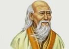

<!--2016-04-17 09:59:40-->
### Лао-Цзы, китайский философ

    Природа никогда не спешит, но всегда успевает.

>

    Лучшее знание — это незнание о том, что ты что-то знаешь.

>

    Быть спокойным, непринуждённым и великодушным — это лекарство.

>

    У хорошего путешественника нет точных планов и 
    намерения попасть куда-то.

>

    Нет ничего более сильного и созидательного, чем пустота, 
    которую люди стремятся заполнить.