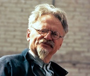

<!--2017-11-06 19:49:12-->
### [Лев Троцкий, советский революционер]()

    Гораздо легче пожертвовать своей жизнью во имя идеи, 
    чем провести единство идеи через всю свою жизнь.

>

    Старость есть самая неожиданная из всех вещей, 
    которые случаются с человеком.

>

    Насаждайте любовь и понимание - и применяйте силу, 
    если потребуется.

>

    Если ты не можешь убедить своего противника при помощи 
    доводов, тебе следует познакомить его голову с тротуаром.