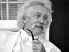

<!--2022-02-01 00:56:11-->
### [Марк Твен, американский писатель]()

    Если вы заметили, что вы на стороне большинства, 
    это верный признак того, что пора меняться.
>
    Работайте так, словно деньги не имеют для 
    вас никакого значения.
>
    Секрет того, чтобы добиться чего-то, – начать.
>
    Единственный способ сохранить здоровье — есть то, 
    что не любишь, пить то, что не нравится, и делать
    то, чего не хочется делать.
>
    Никогда не откладывай на завтра то, 
    что может быть сделано послезавтра
>
    Если бы от выборов что-то зависело, 
    то нам бы не позволили в них участвовать.
>
    Воспоминания - вот из-за чего мы стареем. 
    Секрет вечной юности - в умении забывать.
