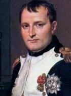

<!--2016-06-09 21:10:32-->
### [Наполеон, французский император]()

    Человек, который много говорит, много может сделать!

>

    Мужчина должен спать четыре часа, женщина — шесть; 
    больше шести часов спят только дети и набитые дурни.

>

    В России нет дорог — только направления.

>

    Копните русского и найдете татарина.