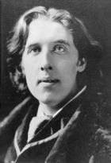

<!--2016-04-17 10:07:50-->
### Оскар Уайлд, британский писатель

    У меня непритязательный вкус: 
    мне вполне достаточно самого лучшего.

>

    В России нет ничего невозможного, кроме реформ.

>

    Жизнь подражает искусству гораздо больше, 
    чем искусство - жизни.

>

    Всегда прощайте своих врагов: 
    ничто не раздражает их так сильно.