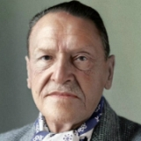

<!--2020-02-02 22:09:34-->
### [Уильям Сомерсет Моэм, британский писатель]()

    Жизнь на десять процентов состоит из того, 
    что вы в ней делаете, а на девяносто – из того, 
    как вы её принимаете.
