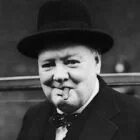

<!--2016-04-17 10:08:46-->
### Уинстон Черчилль, английский политический деятель

    Демократия - лучшая форма правления 
    за исключением всех остальных.

>

    Генералы всегда готовятся к прошлой войне.