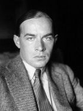

<!--2016-11-21 20:53:25-->
### Эрих Мария Ремарк, немецкий писатель

    Мы так боимся быть навязчивыми, что кажемся равнодушными.

>

    Жизнь, хорошая или плохая, все равно есть жизнь, 
    это замечаешь, только когда вынужден ей рисковать.

>

    Настоящий идеалист стремится к деньгам. 
    Деньги - это свобода. А свобода - жизнь.

>

    Власть - самая въедливая болезнь в мире.

>

    До чего же теперешние молодые люди все странные. 
    Прошлое вы ненавидите, настоящее презираете, 
    а будущее вам безразлично. 
    Вряд ли это приведет к хорошему концу.

>

    Свободен лишь тот, кто потерял все, ради чего стоит жить.