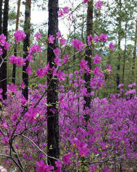

<!--2022-05-03 22:18:00-->
### [Багульник]()
Ядовитый кустарник с розово-фиолетовыми цветками . 
Багульниковое масло применяют при изготовлении мыла.

 &emsp; 
Названия &emsp; ***Дикий розмарин***, ***Багун***, ***Болотник***.
