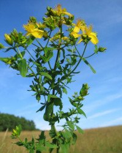

<!--2022-07-20 00:40:00-->
### Зверобой
Многолетнее растение с жёлтыми цветками.
Экстракт и Используется как антидепрессант, успокоительное средство.

 &emsp; 
Названия &emsp; ***Красная травица***, ***Зелье светоянское***.
