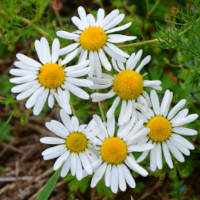

<!--2022-05-29 12:25:00-->
### Ромашка
Многолетнее лекарственное цветковое растение, распространенное в средней полосе России.
Распространенное использование - употребление *ромашкового чая*.

 &emsp; 
Названия &emsp; ***Девичий цветок***, ***Белюшка***.
