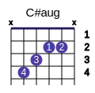
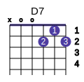

<!--2017-07-16 14:01:55-->
### Таблица аккордов
Примечание: в аккорде слева - *6*-я струна, справа - *1*-я. Строй гитары ***EADGBE***

		  Ab    |    Abm   |    Ab7   |    Abm7  |    Ab6   |  Abmaj7
		466544  |  466444  |  4645X4  |  4644X4  |  46X564  |  XX6543
		--------|----------|----------|----------|----------|--------
		 Abm6   |   Abdim  |   Abaug  |     A    |    Am    |    A7
		466464  |  XX0101  |  XX2110  |  002220  |  002210  |  002020
		--------|----------|----------|----------|----------|--------
		  Am7   |     A6   |   Amaj7  |    Am6   |   Adim   |   Aaug
		002010  |  002222  |  002120  |  002212  |  X01212  |  X03221
		--------|----------|----------|----------|----------|--------
		  Bb    |    Bbm   |    Bb7   |   Bbm7   |    Bb6   |  Bbmaj7
		113331  |  113321  |  113131  |  113121  |  113333  |  113231
		--------|----------|----------|----------|----------|--------
		 Bbm6   |   Bbdim  |   Bbaug  |    B     |    Bm    |    B7
		113323  |  XX2323  |  XX4221  |  224442  |  224432  |  X21202
		--------|----------|----------|----------|----------|--------
		  Bm7   |     B6   |   Bmaj7  |    Bm6   |   Bdim   |   Baug
		X20202  |  224444  |  224342  |  224434  |  XX0101  |  XX5443
		--------|----------|----------|----------|----------|--------
		  C     |    Cm    |    C7    |    Cm7   |    C6    |   Cmaj7
		032010  |  335543  |  032310  |  335343  |  335555  |  332000
		--------|----------|----------|----------|----------|--------
		  Cm6   |   Cdim   |   Caug   |    C#    |    C#m   |    C#7
		335545  |  XX1212  |  032110  |  446664  |  446654  |  X4342X
		--------|----------|----------|----------|----------|--------
		 C#m7   |   C#6    |  C#maj7  |   C#m6   |   C#dim  |   C#aug
		446454  |  446666  |  446564  |  012120  |  XX2323  |  XX3221
		--------|----------|----------|----------|----------|--------
		  D     |    Dm    |    D7    |    Dm7   |    D6    |   Dmaj7
		X00232  |  X00231  |  X00212  |  X00211  |  X00202  |  X00222
		--------|----------|----------|----------|----------|--------
		  Dm6   |   Ddim   |   Daug   |    Eb    |    Ebm   |    Eb7
		X00201  |  XX0101  |  XX0332  |  668886  |  668876  |  X6564X
		--------|----------|----------|----------|----------|--------
		 Ebm7   |  Eb6     |  Ebmaj7  |   Ebm6   |   Ebdim  |   Ebaug
		668676  |  668888  |  X11333  |  X3434X  |  XX1212  |  XX5443
		--------|----------|----------|----------|----------|--------
		  E     |    Em    |    E7    |    Em7   |    E6    |   Emaj7
		022100  |  022000  |  020100  |  020010  |  022120  |  022444
		--------|----------|----------|----------|----------|--------
		  Em6   |   Edim   |   Eaug   |    F     |   Fm     |    F7
		022020  |  0X2323  |  032110  |  X03211  |  XX3111  |  131211
		--------|----------|----------|----------|----------|--------
		  Fm7   |    F6    |   Fmaj7  |   Fm6    |   Fdim   |   Faug
		131111  |  13X231  |  XX3210  |  XX0111  |  XX0101  |  X03221
		--------|----------|----------|----------|----------|--------
		  F#    |   F#m    |    F#7   |   F#m7   |   F#6    |  F#maj7
		244322  |  244222  |  XX4320  |  242222  |  24X342  |  XX4321
		--------|----------|----------|----------|----------|--------
		 F#m6   |   F#dim  |   F#aug  |    G     |    Gm    |    G7
		X01222  |  X01212  |  XX4332  |  320003  |  133111  |  320001
		--------|----------|----------|----------|----------|--------
		 Gm7    |    G6    |   Gmaj7  |   Gm6    |   Gdim   |   Gaug
		131111  |  320000  |  320002  |  X10030  |  XX2323  |  XX5443

Другой вариант аккордов:

