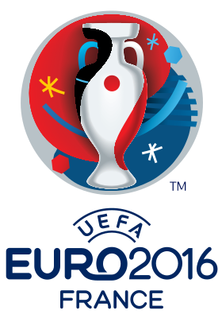

<!--2021-07-10 20:40:51-->
## ЧЕ-2016. Финальный раунд
<table class="p scroll mw_f">
<tr>
  <th class=mb>1/8 финала</th>
  <th>1/4 финала</th>
  <th>1/2 финала</th>
  <td rowspan=8 valign=center align=center></td>
</tr>
<tr>
  <td class="col mt bb"><b><em>1</em></b>
  <td></td>
  <td></td>
</tr>
<tr>
  <td class="col mb br"><b><em>2</em></b><i> пн</i>
  <td valign=bottom class="col bb"><b><em>1</em></b></td>
  <td></td>
</tr>
<tr>
  <td class="col mt bb br"><b><em>0</em></b>
  <td valign=top class="col br"><b><em>2</em></b><i> пн</i></td>
  <td></td>
</tr>
<tr>
  <td class="col mb"><b><em>1</em></b><i> дв</i>
  <td class=br></td>
  <td valign=bottom class="col bb"><b><em>2</em></b></td>
</tr>
<tr>
  <td class="col mt bb"><b><em>1</em></b>
  <td class=br></td>
  <td valign=top class="col br"><b><em>0</em></b></td>
</tr>
<tr>
  <td class="col mb br"><b><em>0</em></b>
  <td valign=bottom class="col bb br"><b><em>3</em></b></td>
  <td class=br></td>
</tr>
<tr>
  <td class="col mt bb br"><b><em>0</em></b>
  <td valign=top class=col><b><em>1</em></b></td>
  <td class=br></td>
</tr>
<tr>
  <td class="col mb"><b><em>4</em></b>
  <td></td>
  <td class=br></td>
  <td valign=bottom class="col bb"><b><em>1</em></b><i> дв</i></td>
</tr>
<tr>
  <td class="col mt bb"><b><em>3</em></b>
  <td></td>
  <td class=br></td>
  <td valign=top class=col><b><em>0</em></b></td>
</tr>
<tr>
  <td class="col mb br"><b><em>0</em></b>
  <td valign=bottom class="col bb"><b><em>2</em></b><i> пн</i></td>
  <td class=br></td>
  <td></td>
</tr>
<tr>
  <td class="col mt bb br"><b><em>2</em></b>
  <td valign=top class="col br"><b><em>1</em></b></td>
  <td class=br></td>
  <td></td>
</tr>
<tr>
  <td class="col mb"><b><em>0</em></b>
  <td class=br></td>
  <td valign=bottom class="col bb br"><b><em>0</em></b></td>
  <td></td>
</tr>
<tr>
  <td class="col mt bb"><b><em>2</em></b>
  <td class=br></td>
  <td valign=top class=col><b><em>2</em></b></td>
  <td></td>
</tr>
<tr>
  <td class="col mb br"><b><em>1</em></b>
  <td valign=bottom class="col bb br"><b><em>5</em></b></td>
  <td></td>
  <td></td>
</tr>
<tr>
  <td class="col mt bb br"><b><em>1</em></b>
  <td valign=top class=col><b><em>2</em></b></td>
  <td></td>
  <td></td>
</tr>
<tr>
  <td class=col><b><em>2</em></b>
  <td></td>
  <td></td>
  <td></td>
</tr>
</table>

<table class="p scroll mw_f">
<tr>
  <th class=col> Голы </th>
  <td class=col>А. Гризманн (Франц.)</td>
  <td valign=top rowspan=2><b><em>6</em></b></td>
</tr>
<tr>
  <th></th>
  <td class=col>Р. Левандовский (Пол.)</td>
</tr>
</table>
