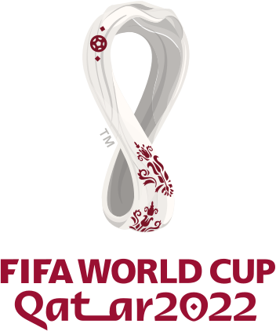

<!--2023-04-23 22:01:41-->
## ЧМ-2022. Плей-офф
<table class="p scroll mw_f">
<tr>
  <th class=mb>1/8 финала</th>
  <th>1/4 финала</th>
  <th>1/2 финала</th>
  <td rowspan=8 valign=center align=center class=logo></td>
</tr>
<tr>
  <td class="col mt bb"><b><em>3</em></b>
  <td></td>
  <td></td>
</tr>
<tr>
  <td class="col mb br"><b><em>1</em></b>
  <td valign=bottom class="col bb"><b><em>2</em></b>
  <td></td>
</tr>
<tr>
  <td class="col mt bb br"><b><em>2</em></b>
  <td valign=top class="col br"><b><em>3</em></b><i> пн</i>
  <td></td>
</tr>
<tr>
  <td class="col mb"><b><em>1</em></b>
  <td class=br></td>
  <td valign=bottom class="col bb"><b><em>3</em></b>
</tr>
<tr>
  <td class="col mt bb"><b><em>1</em></b>
  <td class=br></td>
  <td valign=top class="col br"><b><em>0</em></b>
</tr>
<tr>
  <td class="col mb br"><b><em>2</em></b><i> пн</i>
  <td valign=bottom class="col bb br"><b><em>2</em></b><i> пн</i>
  <td class=br></td>
</tr>
<tr>
  <td class="col mt bb br"><b><em>4</em></b>
  <td valign=top class=col><b><em>1</em></b>
  <td class=br></td>
</tr>
<tr>
  <td class="col mb"><b><em>1</em></b>
  <td></td>
  <td class=br></td>
  <td valign=bottom class="col bb"><b><em>4</em></b><i> пн</i>
</tr>
<tr>
  <td class="col mt bb"><b><em>3</em></b>
  <td></td>
  <td class=br></td>
  <td valign=top class=col><b><em>3</em></b>
</tr>
<tr>
  <td class="col mb br"><b><em>0</em></b>
  <td valign=bottom class="col bb"><b><em>1</em></b>
  <td class=br></td>
  <td></td>
</tr>
<tr>
  <td class="col mt bb br"><b><em>3</em></b>
  <td valign=top class="col br"><b><em>2</em></b>
  <td class=br></td>
  <td></td>
</tr>
<tr>
  <td class="col mb"><b><em>1</em></b>
  <td class=br></td>
  <td valign=bottom class="col bb br"><b><em>2</em></b>
  <td></td>
</tr>
<tr>
  <td class="col mt bb"><b><em>1</em></b><i> пн</i>
  <td class=br></td>
  <td valign=top class="col br"><b><em>0</em></b>
  <th>3-е место</th>
</tr>
<tr>
  <td class="col mb br"><b><em>0</em></b>
  <td valign=bottom class="col bb br"><b><em>1</em></b>
  <td class=br></td>
  <td valign=bottom class="col mt bb"><b><em>2</em></b>
</tr>
<tr>
  <td valign=bottom class="col mt bb br"><b><em>6</em></b>
  <td valign=top class=col><b><em>0</em></b>
  <td></td>
  <td class="col mb"><b><em>1</em></b>
</tr>
<tr>
  <td class=col><b><em>1</em></b>
  <td></td>
  <td></td>
  <td></td>
</tr>
</table>

<table class="p scroll mw_f">
<tr>
  <th class=col> Голы </th>
  <td class=col>Килиан Мбаппе (Фр.)</td>
  <td valign=top><b><em>8</em></b></td>
</tr>
</table>
