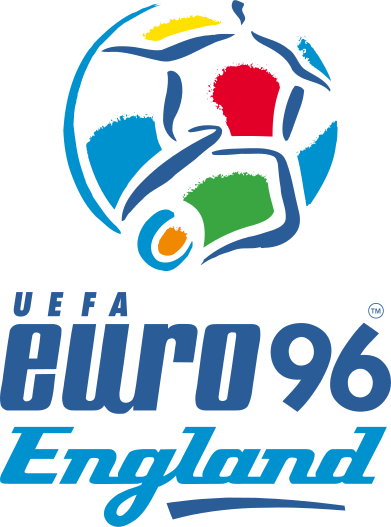

<!--2021-06-05 10:02:01-->
### [ЧЕ-1996. Плей-офф]("Чемпионат Европы по футболу 1996")
<table class=p>
<tr>
  <th class=mb>1/4 финала</th>
  <th>1/2 финала</th>
  <td rowspan=4 align=center valign=center></td>
</tr>
<tr>
  <td class="col mt"><b><i>1</i></b><i> пн</i></td>
  <td></td>
</tr>
<tr>
  <td class="col bt br mb"><b><i>0</i></b></td>
  <td valign=bottom class="col bb"><b><i>1</i></b></td>
</tr>
<tr>
  <td class="col bb br mt"><b><i>2</i></b></td>
  <td valign=top class="col br"><b><i>2</i></b><i> пн</i></td>
</tr>
<tr>
  <td class="col mb"><b><i>1</i></b></td>
  <td class=br></td>
  <td valign=bottom class=col><b><i>2</i></b><i> дв</i></td>
</tr>
<tr>
  <td class="col mt"><b><i>0</i></b></td>
  <td class=br></td>
  <td valign=top class="col bt"><b><i>1</i></b></td>
</tr>
<tr>
  <td class="col bt br mb"><b><i>1</i></b><i> пн</i></td>
  <td valign=bottom class="col bb br"><b><i>0</i></b></td>
  <td></td>
</tr>
<tr>
  <td class="col bb br mt"><b><i>1</i></b></td>
  <td valign=top class=col><b><i>1</i></b><i> пн</i></td>
  <td></td>
</tr>
<tr>
  <td class="col mb"><b><i>0</i></b></td>
  <td></td>
  <td></td>
</tr>
</table>

<table class=p>
<tr>
  <th class=col> Голы </th>
  <td class=col>Алан Ширер (Анг.)</td>
  <td valign=top><b><i>5</i></b></td>
</tr>
</table>
