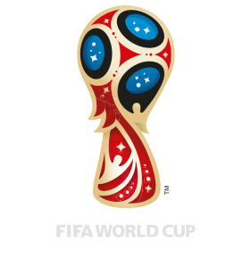

<!--2021-09-10 13:00:03-->
### [ЧМ-2018. Плей-офф]("Чемпионат Мира по футболу 2018")
<table class=p>
<tr>
  <th class=mb>1/8 финала</th>
  <th>1/4 финала</th>
  <th>1/2 финала</th>
  <td rowspan=8 valign=center align=center></td>
</tr>
<tr>
  <td class="col mt bb"><b><i>2</i></b>
  <td></td>
  <td></td>
</tr>
<tr>
  <td class="col mb br"><b><i>1</i></b>
  <td valign=bottom class="col bb"><b><i>0</i></b>
  <td></td>
</tr>
<tr>
  <td class="col mt bb br"><b><i>4</i></b>
  <td valign=top class="col br"><b><i>2</i></b>
  <td></td>
</tr>
<tr>
  <td class="col mb"><b><i>3</i></b>
  <td class=br></td>
  <td valign=bottom class="col bb"><b><i>1</i></b>
</tr>
<tr>
  <td class="col mt bb"><b><i>2</i></b>
  <td class=br></td>
  <td valign=top class="col br"><b><i>0</i></b>
</tr>
<tr>
  <td class="col mb br"><b><i>0</i></b>
  <td valign=bottom class="col bb br"><b><i>1</i></b>
  <td class=br></td>
</tr>
<tr>
  <td class="col mt bb br"><b><i>3</i></b>
  <td valign=top class=col><b><i>2</i></b>
  <td class=br></td>
</tr>
<tr>
  <td class="col mb"><b><i>2</i></b>
  <td></td>
  <td class=br></td>
  <td valign=bottom class="col bb"><b><i>4</i></b>
</tr>
<tr>
  <td class="col mt bb"><b><i>1</i></b>
  <td></td>
  <td class=br></td>
  <td valign=top class=col><b><i>2</i></b>
</tr>
<tr>
  <td class="col mb br"><b><i>2</i></b><i> пн</i>
  <td valign=bottom class="col bb"><b><i>2</i></b>
  <td class=br></td>
  <td></td>
</tr>
<tr>
  <td class="col mt bb br"><b><i>2</i></b><i> пн</i>
  <td valign=top class="col br"><b><i>3</i></b><i> пн</i>
  <td class=br></td>
  <td></td>
</tr>
<tr>
  <td class="col mb"><b><i>1</i></b>
  <td class=br></td>
  <td valign=bottom class="col bb br"><b><i>2</i></b><i> дв</i>
  <td></td>
</tr>
<tr>
  <td class="col mt bb"><b><i>1</i></b>
  <td class=br></td>
  <td valign=top class="col br"><b><i>1</i></b>
  <th>3-е место</th>
</tr>
<tr>
  <td class="col mb br"><b><i>0</i></b>
  <td valign=bottom class="col bb br"><b><i>0</i></b>
  <td class=br></td>
  <td valign=bottom class="col mt bb"><b><i>2</i></b>
</tr>
<tr>
  <td valign=bottom class="col mt bb br"><b><i>1</i></b>
  <td valign=top class=col><b><i>2</i></b>
  <td></td>
  <td class="col mb"><b><i>0</i></b>
</tr>
<tr>
  <td class=col><b><i>2</i></b><i> пн</i>
  <td></td>
  <td></td>
  <td></td>
</tr>
</table>

<table class=p>
<tr>
  <th class=col> Голы </th>
  <td class=col>Харри Кейн (Анг.)</td>
  <td valign=top><b><i>6</i></b></td>
</tr>
</table>
