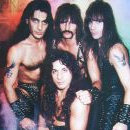

Американская пауэр-металл группа, известная своей воинственной тематикой песен.

* [Achilles, Agony And Ecstasy In Eight Parts](Achilles,%20Agony%20And%20Ecstasy%20In%20Eight%20Parts.md)
* [Battle Hymn](Battle%20Hymn.md)
* [Blood Of The Kings](Blood%20Of%20The%20Kings.md)
* [Bridge Of Death](Bridge%20Of%20Death.md)
* [Courage](Courage.md)
* [Dark Avenger](Dark%20Avenger.md)
* [Defender](Defender.md)
* [Fast Taker](Fast%20Taker.md)
* [Hail & Kill](Hail%20&%20Kill.md)
* [Hearth Of Steel](Hearth%20Of%20Steel.md)
* [Kingdom Come](Kingdom%20Come.md)
* [Kings Of Metal](Kings%20Of%20Metal.md)
* [Manowar](Manowar.md)
* [Master of the Wind](Master%20of%20the%20Wind.md)
* [Metal Daze](Metal%20Daze.md)
* [Metal Warriors](Metal%20Warriors.md)
* [Pleasure Slave](Pleasure%20Slave.md)
* [Shell Shock](Shell%20Shock.md)
* [Spritit Horse of the Cherokee](Spritit%20Horse%20of%20the%20Cherokee.md)
* [Sword In The Wind](Sword%20In%20The%20Wind.md)
* [The Crown And The Ring](The%20Crown%20And%20The%20Ring.md)