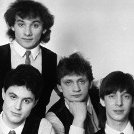

Советская и российская рок-группа, основанная Николаем Фоменко, Максимом Леонидовым и Дмитрием Рубином в Ленинграде в 1983 году.

* [10 лет](10%20лет.md)
* [1000 пластинок](1000%20пластинок.md)
* [17 лет](17%20лет.md)
* [2000 год](2000%20год.md)
* [Blues De Moscou](Blues%20De%20Moscou.md)
* [Roadrunner](Roadrunner.md)
* [Rock'n'roll medley](Rock'n'roll%20medley.md)
* [Алиса (2 вариант)](Алиса%20(2%20вариант).md)
* [Алиса](Алиса.md)
* [Ангел дороги](Ангел%20дороги.md)
* [Арина-балерина](Арина-балерина.md)
* [Беда - не беда](Беда%20-%20не%20беда.md)
* [Белая птица](Белая%20птица.md)
* [Береги свой хой](Береги%20свой%20хой.md)
* [Беспечный ездок](Беспечный%20ездок.md)
* [Билет](Билет.md)
* [Блюз бродячих собак](Блюз%20бродячих%20собак.md)
* [Буги-вуги](Буги-вуги.md)
* [Букетик незабудок](Букетик%20незабудок.md)
* [В дальних странах](В%20дальних%20странах.md)
* [В жарких странах (Капитаны)](В%20жарких%20странах%20(Капитаны).md)
* [Весна](Весна.md)
* [Ветер новых дней](Ветер%20новых%20дней.md)
* [Вниз по течению](Вниз%20по%20течению.md)
* [Возьми меня](Возьми%20меня.md)
* [Вспомни годы](Вспомни%20годы.md)
* [Всё ОК](Всё%20ОК.md)
* [Где найти слова](Где%20найти%20слова.md)
* [Давай, заводи](Давай,%20заводи.md)
* [Дай мне шанс](Дай%20мне%20шанс.md)
* [Дай мне](Дай%20мне.md)
* [Дарю, дарю](Дарю,%20дарю.md)
* [Дарю-дарю](Дарю-дарю.md)
* [Две гантели и один утюг](Две%20гантели%20и%20один%20утюг.md)
* [Доктор Оттепель](Доктор%20Оттепель.md)
* [Домой](Домой.md)
* [Если ты уйдешь](Если%20ты%20уйдешь.md)
* [Еще не поздно](Еще%20не%20поздно.md)
* [Зенит - чемпион](Зенит%20-%20чемпион.md)
* [Иди домой](Иди%20домой.md)
* [Именины у Кристины](Именины%20у%20Кристины.md)
* [Как дела, старина](Как%20дела,%20старина.md)
* [Кеды](Кеды.md)
* [Кончайте, папа](Кончайте,%20папа.md)
* [Конь](Конь.md)
* [Коррида](Коррида.md)
* [Ленинградское время](Ленинградское%20время.md)
* [Лиза](Лиза.md)
* [Любовь Петровна](Любовь%20Петровна.md)
* [Мажорный рок-н-ролл](Мажорный%20рок-н-ролл.md)
* [Мама](Мама.md)
* [Между небом и землёй](Между%20небом%20и%20землёй.md)
* [Морские волки](Морские%20волки.md)
* [Москва-река](Москва-река.md)
* [Моя любовь на пятом этаже (2 вариант)](Моя%20любовь%20на%20пятом%20этаже%20(2%20вариант).md)
* [Моя любовь на пятом этаже](Моя%20любовь%20на%20пятом%20этаже.md)
* [Музыка нон-стоп](Музыка%20нон-стоп.md)
* [Не Грусти](Не%20Грусти.md)
* [Не говори мне прощай](Не%20говори%20мне%20прощай.md)
* [Не забудь](Не%20забудь.md)
* [Не переживай](Не%20переживай.md)
* [Не плачь, гитара](Не%20плачь,%20гитара.md)
* [Не трогай только гитару](Не%20трогай%20только%20гитару.md)
* [Ничего не бойся](Ничего%20не%20бойся.md)
* [Ничего не исчезает](Ничего%20не%20исчезает.md)
* [Ночь](Ночь.md)
* [Ну что мне делать](Ну%20что%20мне%20делать.md)
* [Обиды не тая](Обиды%20не%20тая.md)
* [Одна в трехкомнатной квартире](Одна%20в%20трехкомнатной%20квартире.md)
* [Одна в трёхкомнатной квартире](Одна%20в%20трёхкомнатной%20квартире.md)
* [Она не понимает](Она%20не%20понимает.md)
* [Она считает меня дураком](Она%20считает%20меня%20дураком.md)
* [Она так любит](Она%20так%20любит.md)
* [Оркестр в пути](Оркестр%20в%20пути.md)
* [Отказали тормоза](Отказали%20тормоза.md)
* [Отправляйся за ней](Отправляйся%20за%20ней.md)
* [Патрульный Петров](Патрульный%20Петров.md)
* [Перелетная птица](Перелетная%20птица.md)
* [Песенка про ведьму](Песенка%20про%20ведьму.md)
* [Песня гномов](Песня%20гномов.md)
* [По дороге домой](По%20дороге%20домой.md)
* [Пойди туда](Пойди%20туда.md)
* [Попутная](Попутная.md)
* [Пора бежать](Пора%20бежать.md)
* [Посвящение Битлз](Посвящение%20Битлз.md)
* [Последний трамвай](Последний%20трамвай.md)
* [Последний час декабря](Последний%20час%20декабря.md)
* [Почему](Почему.md)
* [Привет](Привет.md)
* [Прощай, ночь, прости](Прощай,%20ночь,%20прости.md)
* [Прощай](Прощай.md)
* [Пусть будет так всегда](Пусть%20будет%20так%20всегда.md)
* [Путь в сторону солнца](Путь%20в%20сторону%20солнца.md)
* [Рая и Ада](Рая%20и%20Ада.md)
* [Рита](Рита.md)
* [Розы и сталь](Розы%20и%20сталь.md)
* [С нами Бог](С%20нами%20Бог.md)
* [Сара Бара-Бу](Сара%20Бара-Бу.md)
* [Сара Барабу](Сара%20Барабу.md)
* [Секретомания](Секретомания.md)
* [Сердце на твоем берегу](Сердце%20на%20твоем%20берегу.md)
* [Сердце на твоём берегу](Сердце%20на%20твоём%20берегу.md)
* [Сидя на крыше](Сидя%20на%20крыше.md)
* [Скоро навсегда](Скоро%20навсегда.md)
* [Снова рядом](Снова%20рядом.md)
* [Сон в руку](Сон%20в%20руку.md)
* [Сорок секунд](Сорок%20секунд.md)
* [Старый джаз](Старый%20джаз.md)
* [Старый ковбой](Старый%20ковбой.md)
* [Странные дни](Странные%20дни.md)
* [Студент](Студент.md)
* [Твист](Твист.md)
* [Твои шаги](Твои%20шаги.md)
* [Твой папа был прав](Твой%20папа%20был%20прав.md)
* [То, что называется Любовь](То,%20что%20называется%20Любовь.md)
* [Ты вернёшься ко мне](Ты%20вернёшься%20ко%20мне.md)
* [Ты и я](Ты%20и%20я.md)
* [Ты умеешь летать](Ты%20умеешь%20летать.md)
* [Убегай, крошка](Убегай,%20крошка.md)
* [Уист Уи](Уист%20Уи.md)
* [Четыре](Четыре.md)
* [Шаг за шагом](Шаг%20за%20шагом.md)
* [Эй, парень](Эй,%20парень.md)
* [Это не любовь](Это%20не%20любовь.md)
* [Я вас созвал](Я%20вас%20созвал.md)
* [Я встречу тебя](Я%20встречу%20тебя.md)
* [Я снова бегу](Я%20снова%20бегу.md)