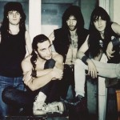

 Cоветско-российская метал-группа, существовавшая в период с 1986 по 1997 год под лидерством бас-гитариста и автора песен *Анатолия Крупнова*. После его смерти коллектив был реорганизован в 1999 году во главе с *Дмитрием Борисенковым*. 

* [Болезнь](Болезнь.md)
* [Война](Война.md)
* [День прошел, а ты все жив](День%20прошел,%20а%20ты%20все%20жив.md)
* [Дом Желтого Сна ч.II](Дом%20Желтого%20Сна%20ч.II.md)
* [Дом Желтого Сна](Дом%20Желтого%20Сна.md)
* [Иди за мной](Иди%20за%20мной.md)
* [Пельменная](Пельменная.md)
* [Полночь](Полночь.md)
* [Про Любовь](Про%20Любовь.md)
* [Свобода](Свобода.md)
* [Стена](Стена.md)
* [Цезарь](Цезарь.md)
* [Черный обелиск](Черный%20обелиск.md)
* [Я Остаюсь](Я%20Остаюсь.md)