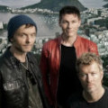

Норвежская группа из Осло, играющая в стиле электро-поп.

* [(Seemingly) Nonstop July]((Seemingly)%20Nonstop%20July.md)
* [A Little Bit](A%20Little%20Bit.md)
* [And You Tell Me](And%20You%20Tell%20Me.md)
* [Angel In The Snow](Angel%20In%20The%20Snow.md)
* [Barely Hanging On](Barely%20Hanging%20On.md)
* [Behind Blue Eyes](Behind%20Blue%20Eyes.md)
* [Blue Sky](Blue%20Sky.md)
* [Cannot Hide](Cannot%20Hide.md)
* [Cold As Stone](Cold%20As%20Stone.md)
* [Cry Wolf](Cry%20Wolf.md)
* [Crying In The Rain](Crying%20In%20The%20Rain.md)
* [Dark Is The Night For All](Dark%20Is%20The%20Night%20For%20All.md)
* [Did Anyone Approach You](Did%20Anyone%20Approach%20You.md)
* [Dragonfly](Dragonfly.md)
* [Dream Myself Alive](Dream%20Myself%20Alive.md)
* [Driftwood](Driftwood.md)
* [Early Morning](Early%20Morning.md)
* [East Of The Sun](East%20Of%20The%20Sun.md)
* [Forever Not Yours (2 вариант)](Forever%20Not%20Yours%20(2%20вариант).md)
* [Forever Not Yours](Forever%20Not%20Yours.md)
* [Here I Stand And Face The Rain](Here%20I%20Stand%20And%20Face%20The%20Rain.md)
* [Hunting High And Low](Hunting%20High%20And%20Low.md)
* [I Call Your Name](I%20Call%20Your%20Name.md)
* [I Dream My Self Alive](I%20Dream%20My%20Self%20Alive.md)
* [I Wish I Cared](I%20Wish%20I%20Cared.md)
* [I've Been Losing You](I've%20Been%20Losing%20You.md)
* [Less Than Pure](Less%20Than%20Pure.md)
* [Lifelines (2 вариант)](Lifelines%20(2%20вариант).md)
* [Lifelines](Lifelines.md)
* [Little Black Heart](Little%20Black%20Heart.md)
* [Living A Boy's Adventure Tale](Living%20A%20Boy's%20Adventure%20Tale.md)
* [Love Is Reason](Love%20Is%20Reason.md)
* [Manhattan Skyline](Manhattan%20Skyline.md)
* [Mary Ellen Makes The Moment Count](Mary%20Ellen%20Makes%20The%20Moment%20Count.md)
* [Maybe, Maybe](Maybe,%20Maybe.md)
* [Minor Earth Major Sky](Minor%20Earth%20Major%20Sky.md)
* [October](October.md)
* [Oranges On Apple Trees](Oranges%20On%20Apple%20Trees.md)
* [Rolling Thunder](Rolling%20Thunder.md)
* [Scoundrel Days](Scoundrel%20Days.md)
* [Slender Frame](Slender%20Frame.md)
* [Soft Rains Of April](Soft%20Rains%20Of%20April.md)
* [Solace](Solace.md)
* [Stay On These Roads](Stay%20On%20These%20Roads.md)
* [Summer Moved On (2 вариант)](Summer%20Moved%20On%20(2%20вариант).md)
* [Summer Moved On](Summer%20Moved%20On.md)
* [Sycamore Leaves](Sycamore%20Leaves.md)
* [Take on me](Take%20on%20me.md)
* [The Blood That Moves The Body](The%20Blood%20That%20Moves%20The%20Body.md)
* [The Blue Sky](The%20Blue%20Sky.md)
* [The Company Man](The%20Company%20Man.md)
* [The Sun Always Shines On T.V.](The%20Sun%20Always%20Shines%20On%20T.V..md)
* [The Sun Never Shone That Day](The%20Sun%20Never%20Shone%20That%20Day.md)
* [The Swing Of Things](The%20Swing%20Of%20Things.md)
* [The Weight Of The Wind](The%20Weight%20Of%20The%20Wind.md)
* [There's A Reason For It](There's%20A%20Reason%20For%20It.md)
* [This Alone Is Love](This%20Alone%20Is%20Love.md)
* [Time And Again](Time%20And%20Again.md)
* [To Let You Win](To%20Let%20You%20Win.md)
* [Train Of Thought](Train%20Of%20Thought.md)
* [Turn The Lights Down](Turn%20The%20Lights%20Down.md)
* [Velvet](Velvet.md)
* [We're Looking For The Whales](We're%20Looking%20For%20The%20Whales.md)
* [White Canvas](White%20Canvas.md)
* [You Wanted More](You%20Wanted%20More.md)
* [You'll Never Get Over Me](You'll%20Never%20Get%20Over%20Me.md)