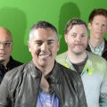

Канадская альтернативная рок-группа из пригорода Торонто, образовалась в *1988* году.

* [A](A.txt)
* [Am I The Only One](Am%20I%20The%20Only%20One.txt)
* [Be My Yoko Ono](Be%20My%20Yoko%20Ono.txt)
* [Break Your Heart](Break%20Your%20Heart.txt)
* [Brian Wilson](Brian%20Wilson.txt)
* [ENID](ENID.txt)
* [Hello City](Hello%20City.txt)
* [If I Had $1000000](If%20I%20Had%20$1000000.txt)
* [If I Had a Million Dollars](If%20I%20Had%20a%20Million%20Dollars.txt)
* [Jane](Jane.txt)
* [Life In A Nutshell](Life%20In%20A%20Nutshell.txt)
* [Lovers in a Dangerous Time](Lovers%20in%20a%20Dangerous%20Time.txt)
* [McDonalds Girl](McDonalds%20Girl.txt)
* [New Kid On the Block](New%20Kid%20On%20the%20Block.txt)
* [Shoe Box](Shoe%20Box.txt)
* [Straw Hat and Old Dirty Hank](Straw%20Hat%20and%20Old%20Dirty%20Hank.txt)
* [The Flag](The%20Flag.txt)
* [The Old Apartment](The%20Old%20Apartment.txt)
* [The Wrong Man was Convicted](The%20Wrong%20Man%20was%20Convicted.txt)
* [What A Good Boy](What%20A%20Good%20Boy.txt)
* [When I Fall](When%20I%20Fall.txt)
* [You Will Be Waiting](You%20Will%20Be%20Waiting.txt)