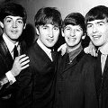

Легендарная липерпульская четверка Джон Леннон, Пол Маккартни, Джордж Харрисон, Ринго Старр, с появлением которой рок-н-ролл стал популярным и массовым занятием.

* [A Day in the Life](A%20Day%20in%20the%20Life.md)
* [A Hard Day's Night](A%20Hard%20Day's%20Night.md)
* [A Little Help From My Friends](A%20Little%20Help%20From%20My%20Friends.md)
* [A Shot of Rhythm and Blues](A%20Shot%20of%20Rhythm%20and%20Blues.md)
* [A Taste of Honey](A%20Taste%20of%20Honey.md)
* [Across The Universe](Across%20The%20Universe.md)
* [Act Naturally](Act%20Naturally.md)
* [All I've got to Do](All%20I've%20got%20to%20Do.md)
* [All My Loving](All%20My%20Loving.md)
* [All Together Now](All%20Together%20Now.md)
* [All You Need Is Love](All%20You%20Need%20Is%20Love.md)
* [All day and all of the night](All%20day%20and%20all%20of%20the%20night.md)
* [And I Love Her](And%20I%20Love%20Her.md)
* [And Your Bird Can Sing](And%20Your%20Bird%20Can%20Sing.md)
* [Anna (Go To Him)](Anna%20(Go%20To%20Him).md)
* [Another Girl](Another%20Girl.md)
* [Any Time At All](Any%20Time%20At%20All.md)
* [Ask Me Why](Ask%20Me%20Why.md)
* [Baby It's You](Baby%20It's%20You.md)
* [Baby's in Black](Baby's%20in%20Black.md)
* [Baby, You're A Rich Man](Baby,%20You're%20A%20Rich%20Man.md)
* [Back in the U.S.S.R.](Back%20in%20the%20U.S.S.R..md)
* [Bad Boy](Bad%20Boy.md)
* [Ballad Of John And Yoko](Ballad%20Of%20John%20And%20Yoko.md)
* [Band on The Run](Band%20on%20The%20Run.md)
* [Because](Because.md)
* [Being for the Benefit of Mr. Kite](Being%20for%20the%20Benefit%20of%20Mr.%20Kite.md)
* [Birthday](Birthday.md)
* [Blackbird](Blackbird.md)
* [Blue Jay Way](Blue%20Jay%20Way.md)
* [Boys](Boys.md)
* [Can't Buy Me Love](Can't%20Buy%20Me%20Love.md)
* [Carry That Weight](Carry%20That%20Weight.md)
* [Chains](Chains.md)
* [Christmastime Is Here Again](Christmastime%20Is%20Here%20Again.md)
* [Clarabella](Clarabella.md)
* [Come Together](Come%20Together.md)
* [Cry Baby Cry](Cry%20Baby%20Cry.md)
* [Day Tripper](Day%20Tripper.md)
* [Dear Prudence](Dear%20Prudence.md)
* [Devil In Her Heart](Devil%20In%20Her%20Heart.md)
* [Dig A Pony](Dig%20A%20Pony.md)
* [Dig It](Dig%20It.md)
* [Dizzy Miss Lizzie](Dizzy%20Miss%20Lizzie.md)
* [Do You Want to Know a Secret](Do%20You%20Want%20to%20Know%20a%20Secret.md)
* [Doctor Robert](Doctor%20Robert.md)
* [Don't Bother Me](Don't%20Bother%20Me.md)
* [Don't Let Me Down](Don't%20Let%20Me%20Down.md)
* [Don't Pass Me By](Don't%20Pass%20Me%20By.md)
* [Don't ever change](Don't%20ever%20change.md)
* [Drive My Car](Drive%20My%20Car.md)
* [Eight Days a Week](Eight%20Days%20a%20Week.md)
* [Eleanor Rigby](Eleanor%20Rigby.md)
* [Every Little Thing](Every%20Little%20Thing.md)
* [Everybody's Trying to be My Baby](Everybody's%20Trying%20to%20be%20My%20Baby.md)
* [Fixing a Hole](Fixing%20a%20Hole.md)
* [For No One](For%20No%20One.md)
* [For You Blue](For%20You%20Blue.md)
* [Free As A Bird](Free%20As%20A%20Bird.md)
* [From Me To You](From%20Me%20To%20You.md)
* [Get Back](Get%20Back.md)
* [Getting Better](Getting%20Better.md)
* [Girl](Girl.md)
* [Give Peace a Chance](Give%20Peace%20a%20Chance.md)
* [Glass Onion](Glass%20Onion.md)
* [Golden Slumbers](Golden%20Slumbers.md)
* [Good Day Sunshine](Good%20Day%20Sunshine.md)
* [Good Morning](Good%20Morning.md)
* [Good Night](Good%20Night.md)
* [Got To Get You Into My Life](Got%20To%20Get%20You%20Into%20My%20Life.md)
* [Happiness is a Warm Gun](Happiness%20is%20a%20Warm%20Gun.md)
* [Hard Day's Night](Hard%20Day's%20Night.md)
* [Hello, Goodbye](Hello,%20Goodbye.md)
* [Help](Help.md)
* [Helter Skelter](Helter%20Skelter.md)
* [Her Majesty](Her%20Majesty.md)
* [Here Comes The Sun](Here%20Comes%20The%20Sun.md)
* [Here, There And Everywhere](Here,%20There%20And%20Everywhere.md)
* [Hey Bulldog](Hey%20Bulldog.md)
* [Hey Jude](Hey%20Jude.md)
* [Hide Your Love Away](Hide%20Your%20Love%20Away.md)
* [Hold Me Tight](Hold%20Me%20Tight.md)
* [Honey Don't](Honey%20Don't.md)
* [Honey Pie](Honey%20Pie.md)
* [I Am the Walrus](I%20Am%20the%20Walrus.md)
* [I Call Your Name](I%20Call%20Your%20Name.md)
* [I Dig A Pony](I%20Dig%20A%20Pony.md)
* [I Don't Want to Spoil the Party](I%20Don't%20Want%20to%20Spoil%20the%20Party.md)
* [I Feel Fine](I%20Feel%20Fine.md)
* [I Me Mine](I%20Me%20Mine.md)
* [I Need You](I%20Need%20You.md)
* [I Saw Her Standing There](I%20Saw%20Her%20Standing%20There.md)
* [I Should Have Known Better](I%20Should%20Have%20Known%20Better.md)
* [I Wanna Be Your Man](I%20Wanna%20Be%20Your%20Man.md)
* [I Want To Hold Your Hand](I%20Want%20To%20Hold%20Your%20Hand.md)
* [I Want To Tell You](I%20Want%20To%20Tell%20You.md)
* [I Want You (She's So Heavy)](I%20Want%20You%20(She's%20So%20Heavy).md)
* [I Will](I%20Will.md)
* [I'll Be Back](I'll%20Be%20Back.md)
* [I'll Be On My Way](I'll%20Be%20On%20My%20Way.md)
* [I'll Cry Instead](I'll%20Cry%20Instead.md)
* [I'll Follow the Sun](I'll%20Follow%20the%20Sun.md)
* [I'll Get You](I'll%20Get%20You.md)
* [I'm Down](I'm%20Down.md)
* [I'm Happy Just to Dance with You](I'm%20Happy%20Just%20to%20Dance%20with%20You.md)
* [I'm Looking Through You](I'm%20Looking%20Through%20You.md)
* [I'm Only Sleeping](I'm%20Only%20Sleeping.md)
* [I'm a Loser](I'm%20a%20Loser.md)
* [I'm so tired](I'm%20so%20tired.md)
* [I've Got A Feeling](I've%20Got%20A%20Feeling.md)
* [I've Just Seen a Face](I've%20Just%20Seen%20a%20Face.md)
* [If I Fell](If%20I%20Fell.md)
* [If I Needed Someone](If%20I%20Needed%20Someone.md)
* [If You've got trouble](If%20You've%20got%20trouble.md)
* [Imagine](Imagine.md)
* [In My Life](In%20My%20Life.md)
* [In Spite Of All The Danger](In%20Spite%20Of%20All%20The%20Danger.md)
* [It Won't Be Long](It%20Won't%20Be%20Long.md)
* [It's All Too Much](It's%20All%20Too%20Much.md)
* [It's Only Love](It's%20Only%20Love.md)
* [Julia](Julia.md)
* [Kansas City](Kansas%20City.md)
* [Keep Your Hands Off My Baby](Keep%20Your%20Hands%20Off%20My%20Baby.md)
* [Komm, Gib Mir Deine Hand](Komm,%20Gib%20Mir%20Deine%20Hand.md)
* [Lady Madonna](Lady%20Madonna.md)
* [Leave My Kitten Alone](Leave%20My%20Kitten%20Alone.md)
* [Let it Be](Let%20it%20Be.md)
* [Little Child](Little%20Child.md)
* [Long Tall Sally](Long%20Tall%20Sally.md)
* [Long, Long, Long](Long,%20Long,%20Long.md)
* [Longer](Longer.md)
* [Love Me Do](Love%20Me%20Do.md)
* [Love You To](Love%20You%20To.md)
* [Lovely Rita](Lovely%20Rita.md)
* [Lucy in the Sky with Diamonds](Lucy%20in%20the%20Sky%20with%20Diamonds.md)
* [Maggie Mae](Maggie%20Mae.md)
* [Magical Mystery Tour](Magical%20Mystery%20Tour.md)
* [Martha My Dear](Martha%20My%20Dear.md)
* [Matchbox](Matchbox.md)
* [Maxwell's Silver Hammer](Maxwell's%20Silver%20Hammer.md)
* [Mean Mr. Mustard](Mean%20Mr.%20Mustard.md)
* [Michelle](Michelle.md)
* [Misery](Misery.md)
* [Money (That's What I Want)](Money%20(That's%20What%20I%20Want).md)
* [Mother Nature's Son](Mother%20Nature's%20Son.md)
* [Mr. Moonlight](Mr.%20Moonlight.md)
* [No Reply](No%20Reply.md)
* [Nobody I Know](Nobody%20I%20Know.md)
* [Norwegian Wood](Norwegian%20Wood.md)
* [Not a Second Time](Not%20a%20Second%20Time.md)
* [Nowhere Man](Nowhere%20Man.md)
* [Ob-La-Di, Ob-La-Da](Ob-La-Di,%20Ob-La-Da.md)
* [Octopus's Garden](Octopus's%20Garden.md)
* [Oh Darling](Oh%20Darling.md)
* [Old Brown Shoe](Old%20Brown%20Shoe.md)
* [One After 909](One%20After%20909.md)
* [One and one is two](One%20and%20one%20is%20two.md)
* [Only A Northern Song](Only%20A%20Northern%20Song.md)
* [P.S. I Love You](P.S.%20I%20Love%20You.md)
* [Paperback Writer](Paperback%20Writer.md)
* [Penny Lane](Penny%20Lane.md)
* [Piggies](Piggies.md)
* [Please Mister Postman](Please%20Mister%20Postman.md)
* [Please Please Me](Please%20Please%20Me.md)
* [Polythene Pam](Polythene%20Pam.md)
* [Rain](Rain.md)
* [Real Love](Real%20Love.md)
* [Revolution](Revolution.md)
* [Rock and Roll Music](Rock%20and%20Roll%20Music.md)
* [Rocky Raccoon](Rocky%20Raccoon.md)
* [Roll Over Beethoven](Roll%20Over%20Beethoven.md)
* [Run For Your Life](Run%20For%20Your%20Life.md)
* [Savoy Truffle](Savoy%20Truffle.md)
* [Sergeant Peppers Lonely](Sergeant%20Peppers%20Lonely.md)
* [Sexy Sadie](Sexy%20Sadie.md)
* [Sgt. Pepper's Lonely Hearts Club Band (Reprise)](Sgt.%20Pepper's%20Lonely%20Hearts%20Club%20Band%20(Reprise).md)
* [Sgt. Pepper's Lonely Hearts Club Band](Sgt.%20Pepper's%20Lonely%20Hearts%20Club%20Band.md)
* [She Came In Through The Bathroom Window](She%20Came%20In%20Through%20The%20Bathroom%20Window.md)
* [She Loves You](She%20Loves%20You.md)
* [She Said, She Said](She%20Said,%20She%20Said.md)
* [She's A Woman](She's%20A%20Woman.md)
* [She's Leaving Home](She's%20Leaving%20Home.md)
* [Sie Liebt Dich](Sie%20Liebt%20Dich.md)
* [Slow Down](Slow%20Down.md)
* [Some Other Guy](Some%20Other%20Guy.md)
* [Something](Something.md)
* [Strawberry Fields Forever](Strawberry%20Fields%20Forever.md)
* [Sun King](Sun%20King.md)
* [Taxman](Taxman.md)
* [Tell Me What You See](Tell%20Me%20What%20You%20See.md)
* [Tell Me Why](Tell%20Me%20Why.md)
* [Thank You Girl](Thank%20You%20Girl.md)
* [That's Alright Mama](That's%20Alright%20Mama.md)
* [The Ballad of John And Yoko](The%20Ballad%20of%20John%20And%20Yoko.md)
* [The Continuing Story of Bungalow Bill](The%20Continuing%20Story%20of%20Bungalow%20Bill.md)
* [The End](The%20End.md)
* [The Fool On The Hill](The%20Fool%20On%20The%20Hill.md)
* [The Inner Light](The%20Inner%20Light.md)
* [The Long And Winding Road](The%20Long%20And%20Winding%20Road.md)
* [The Night Before](The%20Night%20Before.md)
* [The Word](The%20Word.md)
* [The happy rishikesh song](The%20happy%20rishikesh%20song.md)
* [There's A Place](There's%20A%20Place.md)
* [Things We Said Today](Things%20We%20Said%20Today.md)
* [Think For Yourself](Think%20For%20Yourself.md)
* [This Boy](This%20Boy.md)
* [Ticket to Ride](Ticket%20to%20Ride.md)
* [Till There was You](Till%20There%20was%20You.md)
* [Tomorrow Never Knows](Tomorrow%20Never%20Knows.md)
* [Too Much Monkey Business](Too%20Much%20Monkey%20Business.md)
* [Twist and Shout](Twist%20and%20Shout.md)
* [Two of Us](Two%20of%20Us.md)
* [Wait](Wait.md)
* [We Can Work It Out](We%20Can%20Work%20It%20Out.md)
* [What Goes On](What%20Goes%20On.md)
* [What You're Doing](What%20You're%20Doing.md)
* [When I Get Home](When%20I%20Get%20Home.md)
* [When I'm Sixty-Four](When%20I'm%20Sixty-Four.md)
* [While My Guitar Gently Weeps](While%20My%20Guitar%20Gently%20Weeps.md)
* [Why don't we do it in the road](Why%20don't%20we%20do%20it%20in%20the%20road.md)
* [Wild Honey Pie](Wild%20Honey%20Pie.md)
* [With a little help from my friends](With%20a%20little%20help%20from%20my%20friends.md)
* [Within You Without You](Within%20You%20Without%20You.md)
* [Words of Love](Words%20of%20Love.md)
* [Yellow Submarine](Yellow%20Submarine.md)
* [Yer Blues](Yer%20Blues.md)
* [Yes It Is](Yes%20It%20Is.md)
* [Yesterday](Yesterday.md)
* [You Can't Do That](You%20Can't%20Do%20That.md)
* [You Know My Name (Look Up The Number)](You%20Know%20My%20Name%20(Look%20Up%20The%20Number).md)
* [You Know What To Do](You%20Know%20What%20To%20Do.md)
* [You Like Me Too Much](You%20Like%20Me%20Too%20Much.md)
* [You Never Give Me Your Money](You%20Never%20Give%20Me%20Your%20Money.md)
* [You Really Got a Hold on Me](You%20Really%20Got%20a%20Hold%20on%20Me.md)
* [You Won't See Me](You%20Won't%20See%20Me.md)
* [You're Going to Lose That Girl](You're%20Going%20to%20Lose%20That%20Girl.md)
* [You've Got to Hide Your Love Away](You've%20Got%20to%20Hide%20Your%20Love%20Away.md)
* [Your Mother Should Know](Your%20Mother%20Should%20Know.md)