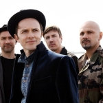

Латвийская рок-группа. Заняла третье место на Евровидении-2000.

* [A Day Before Tomorrow](A%20Day%20Before%20Tomorrow.md)
* [Ain't It Funny](Ain't%20It%20Funny.md)
* [Among The Suns](Among%20The%20Suns.md)
* [Billions Of Stars](Billions%20Of%20Stars.md)
* [Colder](Colder.md)
* [Hide On The Moon](Hide%20On%20The%20Moon.md)
* [It Is Easy](It%20Is%20Easy.md)
* [Its Easy](Its%20Easy.md)
* [Jo To Nac](Jo%20To%20Nac.md)
* [Kitten Who Did Not Want To Give Up](Kitten%20Who%20Did%20Not%20Want%20To%20Give%20Up.md)
* [Leaving To La](Leaving%20To%20La.md)
* [Maybe (2 вариант)](Maybe%20(2%20вариант).md)
* [Maybe](Maybe.md)
* [My Star](My%20Star.md)
* [Online](Online.md)
* [Plaukstas Lieluma Pavasaris](Plaukstas%20Lieluma%20Pavasaris.md)
* [Space Detective Story](Space%20Detective%20Story.md)
* [Spogulit, Spogulit (Hide On The Moon)](Spogulit,%20Spogulit%20(Hide%20On%20The%20Moon).md)
* [Starp Divaam Sauleem (Among The Sun)](Starp%20Divaam%20Sauleem%20(Among%20The%20Sun).md)
* [Under My Wing](Under%20My%20Wing.md)
* [Waterfall](Waterfall.md)
* [Weekends Are Not My Happy Days](Weekends%20Are%20Not%20My%20Happy%20Days.md)
* [Welcome To My Country](Welcome%20To%20My%20Country.md)
* [Ветер](Ветер.md)