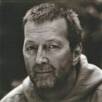

Британский рок-музыкант, гитарист-виртуоз.

* [Aint Nobodys Business](Aint%20Nobodys%20Business.md)
* [Alberta](Alberta.md)
* [Anyday](Anyday.md)
* [Bad Love](Bad%20Love.md)
* [Badge](Badge.md)
* [Before You Accuse Me](Before%20You%20Accuse%20Me.md)
* [Bell Bottom Blues](Bell%20Bottom%20Blues.md)
* [Black Rose](Black%20Rose.md)
* [Blues Before Sunrise](Blues%20Before%20Sunrise.md)
* [Born Under A Bad Sign](Born%20Under%20A%20Bad%20Sign.md)
* [Can't Find My Way Home](Can't%20Find%20My%20Way%20Home.md)
* [Circus Left Town](Circus%20Left%20Town.md)
* [Cocaine](Cocaine.md)
* [Crossroads](Crossroads.md)
* [Easy Now](Easy%20Now.md)
* [Give Me Strength](Give%20Me%20Strength.md)
* [Help Me Up](Help%20Me%20Up.md)
* [Hey, Hey](Hey,%20Hey.md)
* [Holy Mother](Holy%20Mother.md)
* [How Long Blues](How%20Long%20Blues.md)
* [I Can't Hold Out](I%20Can't%20Hold%20Out.md)
* [I Looked Away](I%20Looked%20Away.md)
* [I'm Tore Down](I'm%20Tore%20Down.md)
* [I'm so free](I'm%20so%20free.md)
* [I've Got A Rock And Roll Heart](I've%20Got%20A%20Rock%20And%20Roll%20Heart.md)
* [It Hurts Me Too](It%20Hurts%20Me%20Too.md)
* [It's Too Late](It's%20Too%20Late.md)
* [Keep On Growing](Keep%20On%20Growing.md)
* [Key to the Highway](Key%20to%20the%20Highway.md)
* [Lay Down Sally](Lay%20Down%20Sally.md)
* [Layla](Layla.md)
* [Let It Grow](Let%20It%20Grow.md)
* [Lonely Stranger](Lonely%20Stranger.md)
* [May You Never](May%20You%20Never.md)
* [Mean Old World](Mean%20Old%20World.md)
* [Motherless Child](Motherless%20Child.md)
* [My Father's Eyes](My%20Father's%20Eyes.md)
* [No Alibis](No%20Alibis.md)
* [Nobody Knows You When You're Down and Out](Nobody%20Knows%20You%20When%20You're%20Down%20and%20Out.md)
* [Old Love](Old%20Love.md)
* [Please Be With Me](Please%20Be%20With%20Me.md)
* [Presence Of The Lord](Presence%20Of%20The%20Lord.md)
* [Pretending](Pretending.md)
* [Promises](Promises.md)
* [Roll It Over](Roll%20It%20Over.md)
* [Rollin' And Tumblin'](Rollin'%20And%20Tumblin'.md)
* [Running On Faith](Running%20On%20Faith.md)
* [San Francisco Bay Blues](San%20Francisco%20Bay%20Blues.md)
* [Signe](Signe.md)
* [Sinners Prayer](Sinners%20Prayer.md)
* [Someday, After A While](Someday,%20After%20A%20While.md)
* [Someone Like You](Someone%20Like%20You.md)
* [Swing Low Sweet Chariot](Swing%20Low%20Sweet%20Chariot.md)
* [Tears in Heaven](Tears%20in%20Heaven.md)
* [The Circus Left Town](The%20Circus%20Left%20Town.md)
* [The Sky is Crying](The%20Sky%20is%20Crying.md)
* [Thorn Tree In The Garden](Thorn%20Tree%20In%20The%20Garden.md)
* [Tulsa Time](Tulsa%20Time.md)
* [Walking Blues](Walking%20Blues.md)
* [Watch Out For Lucy](Watch%20Out%20For%20Lucy.md)
* [While my guitar gently weeps](While%20my%20guitar%20gently%20weeps.md)
* [White Room](White%20Room.md)
* [Why Does Love Got To Be So Sad](Why%20Does%20Love%20Got%20To%20Be%20So%20Sad.md)
* [Willie And The Hand Jive](Willie%20And%20The%20Hand%20Jive.md)
* [Wonderful Tonight](Wonderful%20Tonight.md)